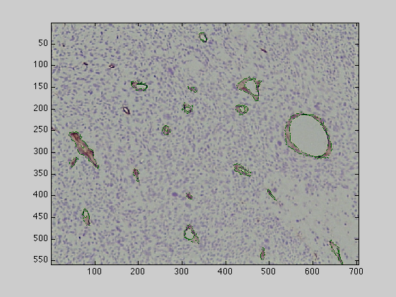
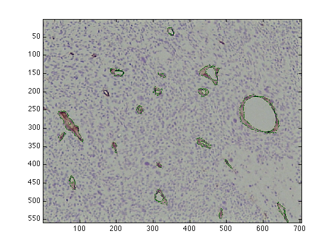
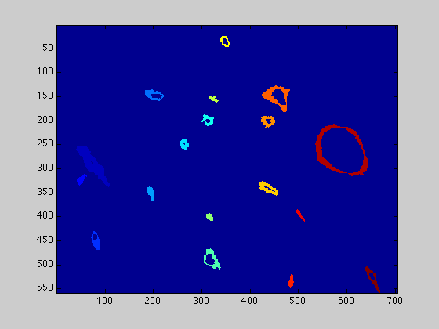
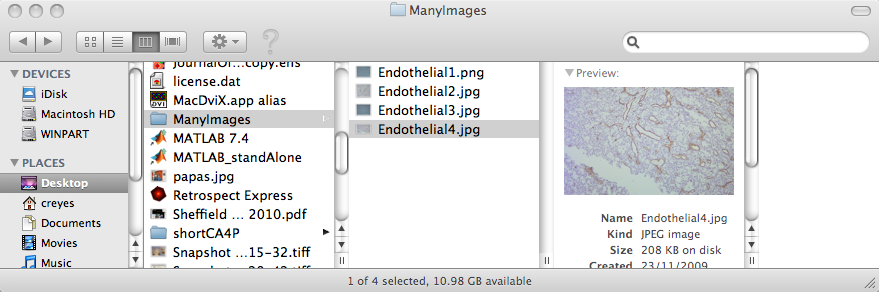
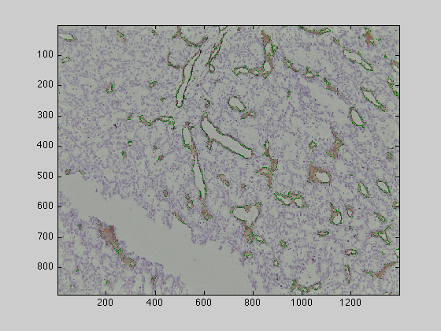

# Microvessel-Segmentation
An automatic algorithm for the segmentation and morphological analysis of microvessels in immunostained histological tumour sections

<h3>
                   
<b> C.C. Reyes-Aldasoro</b>, L Williams, S Akerman, C Kanthou and G. M. Tozer, 
"An automatic algorithm for the segmentation and morphological analysis of microvessels in immunostained histological tumour sections", 
<a href="http://onlinelibrary.wiley.com/doi/10.1111/j.1365-2818.2010.03464.x/abstract">Journal of Microscopy</a>, Volume 242, Issue 3, pages 262–278, June 2011.
</h3>
          
<h2>Introduction</h2>

regionGrowingCells is a matlab programme that loads images that have been stained for CD31 and applies an image-processing
            algorithm for the segmentation and morphological analysis algorithm for the analysis of microvessels from CD31 immunostained
            histological tumour sections. The algorithm exploited the distinctive hues of stained vascular endothelial cells, cell nuclei
            and background, which provided the seeds for a region-growing algorithm in the 3D Hue, Saturation, Value (HSV) colour model.
            The segmented objects were post-processed with three morphological tasks: joining separate objects that were likely to belong
            to a single vessel, closing objects that had a narrow gap around their periphery, and splitting objects with multiple lumens
            into individual vessels.

<h2>Loading the image</h2>

Once matlab has been started, the first step is to load the relevant image to be analysed, this can be done by dragging the
            image from the finder:

<pre class="codeinput">uiopen('/Users/creyes/Sites/testImages/endothelial/Endothelial1.png',1)
</pre>

after which it is necessary to accept the import from the wizard, (just click FINISH), or loading it with imread:

<pre class="codeinput">Endothelial1 = imread('/Users/creyes/Sites/testImages/endothelial/Endothelial1.png');
</pre>

<h2>Segmentation function</h2>

Any of these lines will leave the image as a matlab matrix in the workspace. Once the image is loaded, the first step to process
            is to run the function "regionGrowingCells".

<pre class="codeinput">[finalCells,statsObjects,finalCells_IHC]       = regionGrowingCells(Endothelial1);
         
</pre>

This function will process the image and will segment all the brown endothelial cells stressing the vessel like structures
            as detailed in the Journal of Microscopy paper. The function will display the resulting segmented cells directly, but you
            can plot it in a separate figure with the following commands:
         

         
<pre class="codeinput">
         
figure(1)
imagesc(finalCells_IHC)

figure(3)
imagesc(finalCells)
</pre>

       

         

From the segmented cells, it is possible to extract many measurements (also detailed in the paper). These are obtained with
            the following commands:

<pre class="codeinput">[ObjThickness,stdThickness,propLumen]    = findWallThickness(finalCells);
tempProps                               = regionprops(finalCells,'Perimeter','FilledArea','EquivDiameter');
</pre>

For each object, perimeter, area, filled area, ...  will have calculated and you may be interested in the average value for
            the whole image. To obtain the averages type:

<pre class="codeinput">
avThickness                             = mean(ObjThickness);
avPerimeter                             = mean([tempProps.Perimeter]);
avArea                                  = mean([statsObjects.Area]);
avFilledArea                            = mean([tempProps.FilledArea]);
if avFilledArea&gt;0
    lumenVesselArea                     = mean((([tempProps.FilledArea]-[statsObjects.Area])./[tempProps.FilledArea]));
    avRoundness                         = mean([tempProps.Perimeter]./(sqrt(4*pi*[tempProps.FilledArea])));
end
</pre>

The last "if" is necessary as in some cases there may not be any objects and an error message would appear (do not worry too
            much about this, just copy-and-paste it).

         
<h2>Ratio of brown in the whole image</h2>

Finally, if you are interested just in the total amount of brown in the whole image, this can be calculated by adding all
            the pixels in brown and dividing by the size of the image:

<pre class="codeinput">ratioBrown                              = sum(finalCells(:)&gt;0)/(numel((finalCells)));
</pre>

<h2>Running the function over many images</h2>

If you need to obtain any of the measurements for a large number of images, you do not need to load each of the images individually.
            You can put all your images inside a folder and then run them all in a single "for-loop". Create a folder on the Desktop (it
            can be anywhere but this is to simplify things for the example) named "ManyImages" (again, it can be any name, you would need
            to change it in the code below.

<pre class="codeinput">dirFiles                                = dir('~/Desktop/ManyImages/*.jpg');
</pre>

the previous command will find all the jpg images inside the folder ManyImages. If your images are tif, or bmp, or another
            format, change the last three letters accordingly.

 It may be the case that you have 2 formats, like png and jpg (but ideally
            all your images should be the same format) so the following line covers both png and jpg:
         

         <pre class="codeinput">dirFiles                                = dir('~/Desktop/ManyImages/*.*g');
</pre>
Next you need to find out how many files are inside the folder

<pre class="codeinput">numberFiles = size(dirFiles,1);
</pre>
and then loop over each file in the folder:
<pre class="codeinput">ResultForMeasurement                                = [];

for counterFiles = 1: numberFiles
    % Load the current image
    currentImage = imread(strcat('~/Desktop/ManyImages/',dirFiles(counterFiles).name));

    %process it with the function
    [finalCells,statsObjects,finalCells_IHC]        = regionGrowingCells(currentImage);

    %calculate the measurement you want
    currentRatio                                    = sum(finalCells(:)&gt;0)/(numel((finalCells)));

    %and store it in a matrix that can later be copied to excel:
    ResultForMeasurement(counterFiles,1)           = currentRatio;

end

disp (ResultForMeasurement)

<h2>Final warning</h2>
         

One <b>VERY</b> important thing to notice is that Matlab will not read the files in the same order as the finder of the Macs, therefore the
            order of the files stored will not be exactly the same as the one you will see with the finder. Matlab will read the file
            names sequentially, so File2 will come after File1, File11, File12, ...

